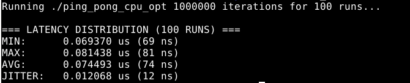

# Extreme Optimization of Inter-Thread Communication (Ping-Pong Latency Test)

**Keywords:** `pthread`, `CPU affinity`, `isolcpus`, `__builtin_ia32_pause()`, `std::memory_order`, `alignas(64)`, `False Sharing`, `True Sharing`, `L1 Cache Miss`, `mlockall`, `perf stat`

## Problem
Two threads alternately modifying a shared atomic variable for a specified number of iterations. The goal is to measure and minimize the absolute inter-thread latency.

## 1. Unoptimized Baseline
The first approach relies on default OS scheduling and standard C++ atomic behavior, with no hardware-level optimizations.

### Thread Function:
```cpp
std::atomic<int> current_value;

struct to_thread {
    int iterations; // number of thread iterations
    int value;      // value the thread wants to set
};

void* thread_work(void* arg) {
    struct to_thread* t = (struct to_thread*)(arg);

    while(t->iterations--) {
        while(true) {
            if(t->value != current_value) {
                current_value = t->value;
                break;
            }
        }
    }
    return nullptr;
}
```

### Thread Call (normal, without any modyfied attributs):

```cpp
    pthread_attr_t attr;
    pthread_attr_init(&attr);
    
    ...

    struct to_thread a;
    struct to_thread b;

    a.iterations = b.iterations = iterations;
    a.value = 0;
    b.value = 1;

    pthread_create(&a_wait, &attr, thread_work, (void*)a);
    pthread_create(&b_wait, &attr, thread_work, (void*)b);
```

## Result (run_bench.sh):


## CPU Optimization:

First of all, to minimize system overhead, I specified which physical cores the threads should use. After checking the topology with `lscpu -e` and knowing that core 0 is heavily used by kernel interrupts, I chose the safe logic cores 4 and 6. Using `lstopo`, I also made sure they are located on the same NUMA node:

```cpp
    pthread_attr_t attra, attrb;
    pthread_attr_init(&attra);
    pthread_attr_init(&attrb);
    
    cpu_set_t cpu_set_a, cpu_set_b;
    CPU_ZERO(&cpu_set_a);
    CPU_ZERO(&cpu_set_b);

    CPU_SET(4, &cpu_set_a);
    CPU_SET(6, &cpu_set_b);
    pthread_attr_setaffinity_np(&attra, sizeof(cpu_set_t), &cpu_set_a);
    pthread_attr_setaffinity_np(&attrb, sizeof(cpu_set_t), &cpu_set_b);
```

To guarantee these cores are strictly exclusive to our threads, and to allow the `sudo cpupower frequency-set -g performance` command to work (bypassing the default Intel scaling driver), I modified the GRUB boot parameters:

```text
GRUB_CMDLINE_LINUX_DEFAULT="quiet splash intel_pstate=disable isolcpus=4,6 nohz_full=4,6 rcu_nocbs=4,6"
```

The second major optimization was adding `__builtin_ia32_pause();` to the spin-wait loop. This prevents the CPU from aggressively predicting hundreds of future iterations, avoiding expensive pipeline flushes when the memory state suddenly changes.

Next, I utilized explicit memory ordering (Acquire/Release semantics) for the atomic operations to improve memory management and prevent heavy global memory fences:

```cpp
            if(t->value != current_value.load(std::memory_order_acquire)){
            
                current_value.store(t->value, std::memory_order_release);
                break;
            }
```

A crucial step was adding `alignas(64)` to the structures and the atomic variable. This aligned the data to the processor's 64-byte Cache Line boundary, solving the "False Sharing" problem that caused massive L1 cache misses.

Hardware profiling using `perf`:

```bash
sudo perf stat -e cs,migrations,L1-dcache-load-misses,LLC-load-misses ./ping_pong_cpu_opt 1000000
```
````
Starting...
Execution time: 76898 Avg per ping-pong: 0.076898

 Performance counter stats for './ping_pong_cpu_opt 1000000':

                 4      cs                                                                    
                 2      migrations                                                            
   <not supported>      cpu_atom/L1-dcache-load-misses/                                       
         2 076 373      cpu_core/L1-dcache-load-misses/                                         (96,39%)
            12 531      cpu_atom/LLC-load-misses/                                               (3,61%)
               243      cpu_core/LLC-load-misses/                                               (96,39%)

       0,080072121 seconds time elapsed

       0,146847000 seconds user
       0,008078000 seconds sys
````
The ~2 million L1 cache misses correspond exactly to the number of times the threads had to read the intentionally modified variable across 1 million ping-pong iterations (True Sharing). This is the absolute physical minimum for this architecture.

The final step was eliminating Minor Page Faults. By forcing the operating system to eagerly allocate physical RAM to virtual addresses at startup, we removed latency spikes caused by lazy memory allocation:

```cpp
    if (mlockall(MCL_CURRENT | MCL_FUTURE) != 0) {
        std::cerr << "mlockall error\n";
        return EXIT_FAILURE;
    }
```
FINAL RESULT:




    
